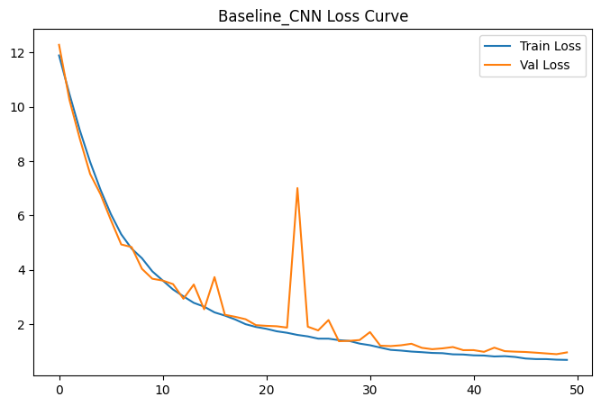
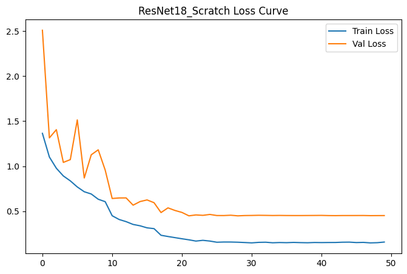
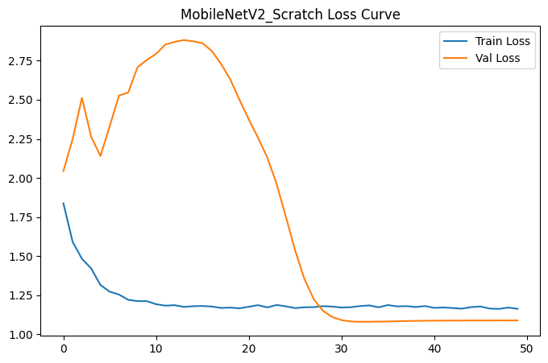
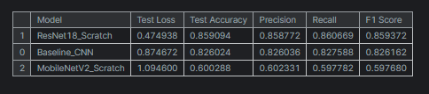
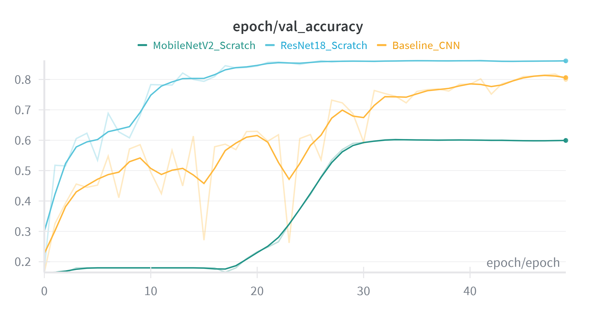
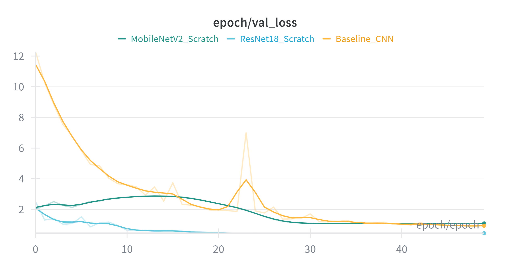
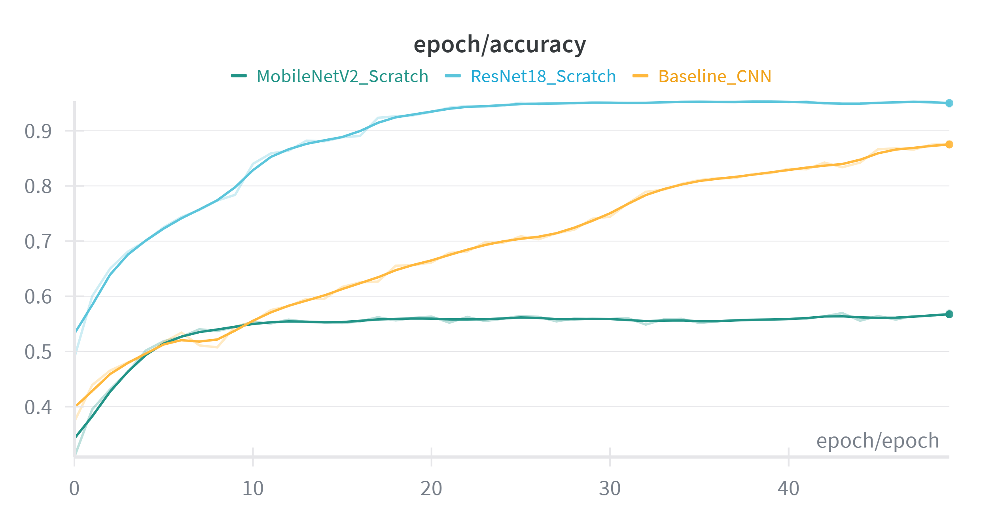
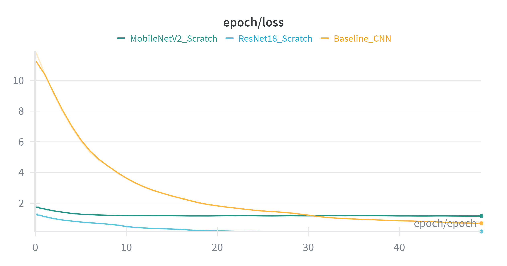

# 🗑️ Garbage Classification using Deep Learning

## 📌 Project Overview
- Deep learning project for automatic garbage classification.
- Predict waste category from input images.
- Compare CNN vs ResNet18 vs MobileNetV2.
- Focus on lightweight and fast models.
- Real-time deployment with Streamlit Cloud.

---

## 🎯 Problem
- Manual garbage sorting is slow and inconsistent.
- Need an AI model for automatic waste classification.
- Goal: accurate + lightweight models for real-world usage.

## 📂 Dataset
- Garbage Images Dataset from Kaggle  
- https://www.kaggle.com/datasets/zlatan599/garbage-dataset-classification
- ~2000 images per class
- 6 Classes:
  - Plastic
  - Metal
  - Glass
  - CardBoard
  - Paper
  - Trash

---

## 🔎 Exploratory Data Analysis (EDA)
- Checked class distribution
- Visualized sample images
- Inspected data quality
- Identified imbalance & noisy samples

---
## ⚙️ Data Preprocessing
- Image resizing & normalization
- Train / Validation / Test split
- Data augmentation
- Label encoding

---

## 🤖 Models
### Baseline CNN
- Simple CNN architecture
- Used as performance baseline

### ResNet18
- Lightweight residual network
- Fast training & inference

### MobileNetV2
- Mobile-friendly architecture
- Efficient and compact

---
## 📊 Experiment Tracking
- Used Weights & Biases (W&B)
- Logged metrics:
  - Validation Loss
  - Validation Accuracy
  - Epoch Accuracy
  - Epoch Loss

---
## 📈 Evaluation

### 🧠 Baseline CNN
#### Train vs Validation Loss


---

### ⚡ ResNet18
#### Train vs Validation Loss


---

### 🚀 MobileNetV2
#### Train vs Validation Loss


#### Testing Results for each model


## 📊 Weights & Biases Reports
### Validation Accuracy


### Validation Loss



### Training Accuracy


### Training Loss


## 🌐 Deployment
- Deployed using Streamlit Cloud
- Features:
  - Upload Image Classification
  - Capture Image from Local Camera
  - Live Real-Time Video Classification
  - Test in this link : https://garbage-classification-test.streamlit.app/
  
 ---
  ## 🛠️ Tech Stack
- Python
- TensorFlow / PyTorch
- Streamlit
- Weights & Biases
- OpenCV / PIL
- NumPy / Pandas / Matplotlib

## 🚀 Run Locally
```bash
git clone https://github.com/yourusername/yourrepo.git
cd yourrepo
pip install -r requirements.txt
streamlit run app.py


